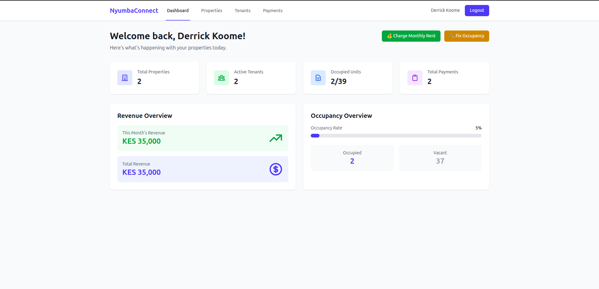
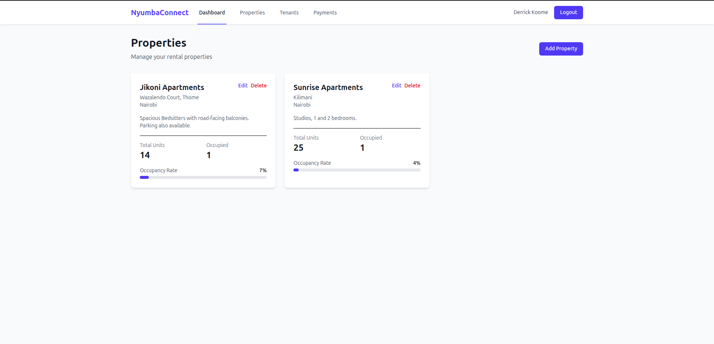
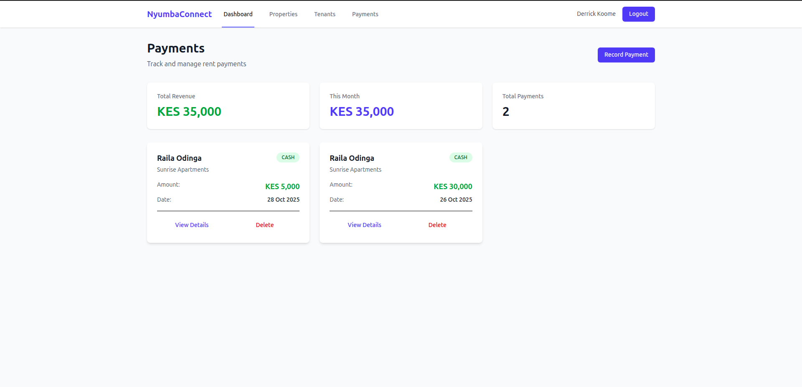
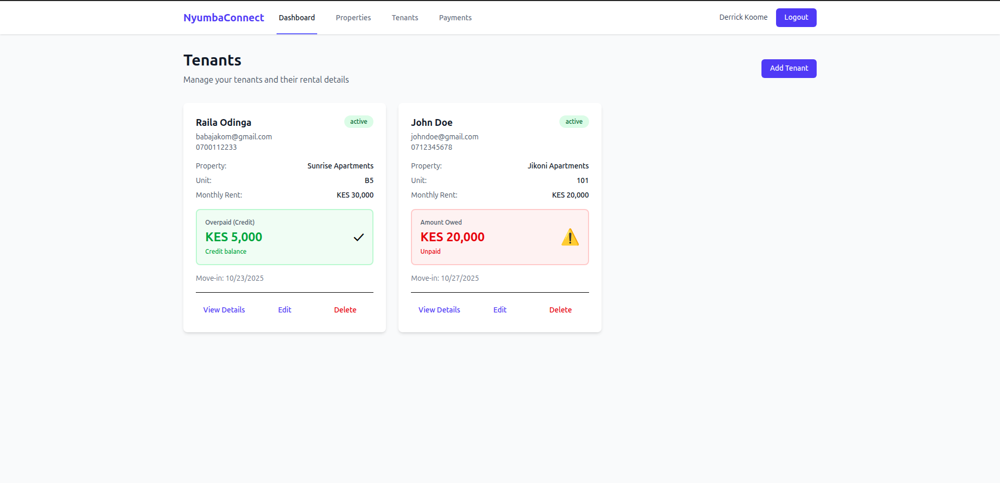

# NyumbaConnect

A comprehensive property management solution built specifically for the Kenyan rental market. This modern web application empowers landlords to efficiently manage rental properties, track tenant information, record payments, and generate comprehensive reports. With a clean, responsive interface and real-time synchronization via Firebase, NyumbaConnect streamlines the entire property management workflow.

🔗 **[View Live Application](https://nyumbaconnect-new.web.app)**

## Key Features

### 🔐 Authentication System
- **Secure Login**: Email/password authentication with Firebase Auth
- **Google Sign-in**: Quick access with Google OAuth integration
- **Protected Routes**: Automatic redirect for unauthenticated users

### 🏢 Properties Management
- **Add Properties**: Register new rental properties with full details
- **Edit & Update**: Modify property information as needed
- **Track Occupancy**: Real-time occupancy status and tenant assignments
- **Property Categories**: Support for apartments, houses, commercial spaces

### 👥 Tenants Management
- **Tenant Profiles**: Complete tenant information storage
- **Balance Tracking**: Automatic rent balance calculations
- **Property Assignment**: Link tenants to specific properties
- **Contact Information**: Store and manage tenant contact details

### 📊 Dashboard & Analytics
- **Real-time Statistics**: Live occupancy rates and revenue metrics
- **Revenue Overview**: Monthly and yearly income tracking
- **Quick Insights**: Property and tenant counts at a glance
- **Data Visualization**: Clean charts and KPI cards

### 💰 Payments Tracking System
- **Record Payments**: Log rent payments with transaction details
- **Payment Methods**: Support for cash, M-Pesa, bank transfers
- **Balance Updates**: Automatic tenant balance adjustments
- **Payment Statistics**: Total revenue, monthly breakdowns, payment history
- **Payment Details**: Transaction IDs, dates, notes, and payment views
- **Delete & Reverse**: Remove payments with automatic balance reversal

### 📄 Receipt Generation *(Coming Soon)*
- **Auto-generated Receipts**: PDF receipts for recorded payments
- **Customizable Templates**: Branded receipt designs
- **Print & Email**: Easy sharing options for tenants

### 📱 Responsive Design
- **Mobile-First**: Optimized for all device sizes
- **Modern UI**: Clean Tailwind CSS styling
- **Intuitive Navigation**: Sidebar navigation with active states

## Screenshots

### Dashboard Overview

*View real-time statistics and manage your properties efficiently*

### Properties Management

*Add and manage your rental properties with ease*

### Payments Tracking

*Record, view, and track all rent payments with detailed statistics*

### Tenant Management

*Keep track of tenant information and balances*


## Contributing

1. Fork the repository
2. Create a feature branch (`git checkout -b feature/amazing-feature`)
3. Commit your changes (`git commit -m 'Add amazing feature'`)
4. Push to the branch (`git push origin feature/amazing-feature`)
5. Open a Pull Request


## Tech Stack

### Frontend
- **React 18**: Component-based UI library for building interactive interfaces
- **Vite**: Fast build tool and development server for modern web projects
- **Tailwind CSS v4**: Utility-first CSS framework for rapid UI development
- **React Router v6**: Declarative routing for React applications

### Backend & Database
- **Firebase Authentication**: Secure user authentication and authorization
- **Firestore**: NoSQL cloud database for real-time data synchronization
- **Firebase Hosting**: Fast, secure hosting for web applications

### Development Tools
- **ESLint**: Code linting and formatting
- **GitHub Actions**: Automated CI/CD pipelines
- **npm**: Package management and script running

**Built with modern JavaScript (ES6+), following React best practices and responsive design principles.**

## Getting Started

### Prerequisites
- Node.js 18 or higher
- Firebase account
- Git

### Local Development
```bash
# Clone the repository
git clone https://github.com/Derrickkoome/nyumbaconnect.git
cd nyumbaconnect

# Install dependencies
npm install

# Create .env file
cp .env
# Add your Firebase credentials to .env

# Run development server
npm run dev
```

### Building for Production
```bash
# Build the project
npm run build

# Preview production build
npm run preview
```

### Deployment

The app automatically deploys to Firebase Hosting via GitHub Actions on every push to the `main` branch.

Manual deployment:
```bash
firebase deploy --only hosting
```

## Development Progress

**Completed:**
- Project Setup & Configuration
- Firebase Integration
- Authentication System (Email/Password + Google)
- Properties CRUD Operations
- Tenants CRUD Operations
- Payments Tracking System
- Dashboard with Statistics
- Responsive Design
- CI/CD with GitHub Actions

**Upcoming:**
- Receipt Generation
- Notifications & Reminders
- Reports & Analytics
- User Roles (Landlord/Tenant views)
- M-Pesa Integration


## License

MIT

## Author

**Derrick Koome**
- GitHub: [@Derrickkoome](https://github.com/Derrickkoome)

---

**Built for the Kenyan rental market**
